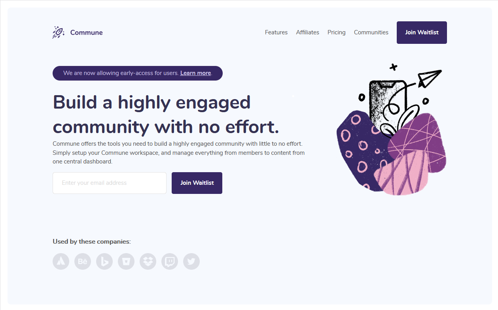

# Commune Waitlist Page

[](https://app.netlify.com/sites/commune-waitlist-page-aileen-r/deploys)

A fully responsive landing page.

[](https://commune-waitlist-page-aileen-r.netlify.app/)

Design taken from the [Commune Waitlist Page Codewell challenge](https://www.codewell.cc/challenges/608d9565747bad001532bd64).

This project was built to demo getting up and running with Parcel for this Dev.to article: [Blazing Fast Frontend Development with Parcel](https://dev.to/aileenr/blazing-fast-frontend-development-with-parcel-21dc).

## Technologies Used

- [Parcel](https://parceljs.org/) web app bundler.
- [PostHTML Include](https://github.com/posthtml/posthtml-include) plugin for Parcel for splitting up HTML files.
- [SASS](https://sass-lang.com/) CSS pre-processor.
- [Netlify](https://www.netlify.com/) for hosting.

## Local Development

### Installs Node packages

```
npm install
```

### Compiles and hot-reloads for development

```
npm start
```

### Production build

```
npm run build
```
